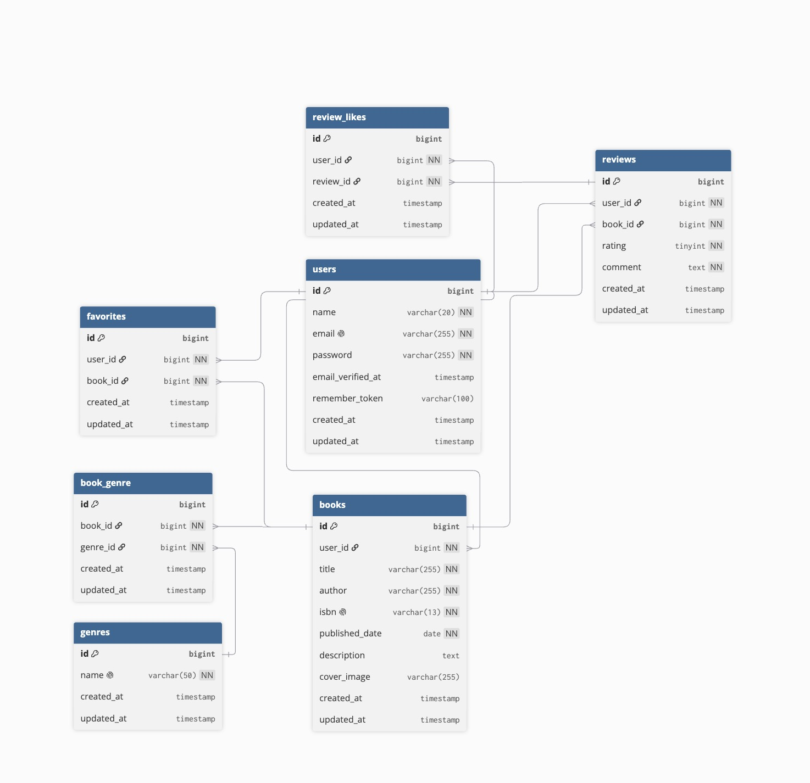

# BookShelf 書籍レビューアプリ

## 概要

BookShelfは、書籍の登録・閲覧・レビュー投稿ができる書籍レビューアプリケーションです。

ユーザーは書籍を登録し、ジャンル分類、レビュー投稿、お気に入り登録、レビューへのいいね、ランキング閲覧を行えます。  
また、外部アプリケーション向けに書籍情報をJSON形式で取得・操作できる公開APIも提供しています。

## 実装機能

- ユーザー登録・ログイン・ログアウト
- 書籍の一覧表示・詳細表示・登録・編集・削除
- キーワード・ジャンル・並び順による書籍検索
- ジャンルの一覧表示・詳細表示・登録・編集・削除
- 書籍レビューの投稿・編集・削除
- お気に入り登録・解除・お気に入り一覧表示
- レビューへのいいね登録・解除
- 平均評価に基づくランキング表示
- ISBN検索によるGoogle Books API連携
- マイ読書レポート表示
- 読書計画の登録・編集・削除・読了管理
- 読書計画のリマインダー通知
- 公開APIによる書籍CRUD
- Laravel SanctumによるAPIトークン認証

## 使用技術

| 項目 | 技術 |
| --- | --- |
| バックエンド | PHP 8.5 / Laravel 10.x |
| データベース | MySQL 8.4 |
| 認証 | Laravel Fortify / Laravel Sanctum |
| フロントエンド | Blade / Vite / Tailwind CSS |
| 開発環境 | Docker / Docker Compose / Laravel Sail |
| DB管理 | phpMyAdmin |
| 外部API | Google Books API |

## 環境構築

### Dockerビルド

```bash
git clone git@github.com:kouki014129/bookshelf.git
cd bookshelf
cp .env.example .env
docker run --rm \
    -u "$(id -u):$(id -g)" \
    -v "$(pwd):/var/www/html" \
    -w /var/www/html \
    -e COMPOSER_CACHE_DIR=/tmp/composer_cache \
    laravelsail/php82-composer:latest \
    composer install
./vendor/bin/sail up -d --build
```

> MacのM1・M2チップのPCでMySQLイメージのビルドエラーが発生する場合は、`compose.yaml` の `mysql` サービスに以下を追加してください。

```yaml
mysql:
    platform: linux/x86_64
```

### Laravel環境構築

1. `.env` のDB設定を確認します。

```text
DB_CONNECTION=mysql
DB_HOST=mysql
DB_PORT=3306
DB_DATABASE=laravel
DB_USERNAME=sail
DB_PASSWORD=password
```

2. アプリケーションキーを生成します。

```bash
./vendor/bin/sail artisan key:generate
```

3. マイグレーションとシーディングを実行します。

```bash
./vendor/bin/sail artisan migrate:fresh --seed
```

4. フロントエンドの依存パッケージをインストールします。

```bash
./vendor/bin/sail npm install
```

5. フロントエンドを起動します。

```bash
./vendor/bin/sail npm run dev
```

## テスト環境構築

PHPUnit実行時は、開発用DBとは別にテスト用DBを使用します。  
Laravel SailのMySQLコンテナ起動時に、テスト用データベース `testing` が作成される構成です。

`phpunit.xml` では以下のようにテスト用DBを指定しています。

```xml
<env name="APP_ENV" value="testing"/>
<env name="DB_DATABASE" value="testing"/>
<env name="CACHE_DRIVER" value="array"/>
<env name="MAIL_MAILER" value="array"/>
<env name="QUEUE_CONNECTION" value="sync"/>
<env name="SESSION_DRIVER" value="array"/>
```

テストを実行します。

```bash
./vendor/bin/sail artisan test
```

カバレッジを確認する場合は以下を実行します。

```bash
./vendor/bin/sail artisan test --coverage
```

コードフォーマットを確認する場合は以下を実行します。

```bash
./vendor/bin/sail pint --test
```

## 開発環境URL

| 項目 | URL |
| --- | --- |
| アプリケーション | http://localhost |
| phpMyAdmin | http://localhost:8080 |

## ER図



## APIエンドポイント一覧

### 認証API

| メソッド | パス | 認証 | 概要 |
| --- | --- | --- | --- |
| POST | `/api/login` | 不要 | ログインしてAPIトークンを発行 |
| POST | `/api/logout` | 必要 | 現在のAPIトークンを削除 |
| GET | `/api/user` | 必要 | 認証中ユーザー情報を取得 |

### 書籍API

| メソッド | パス | 認証 | 概要 |
| --- | --- | --- | --- |
| GET | `/api/v1/books` | 不要 | 書籍一覧を取得 |
| GET | `/api/v1/books/{book}` | 不要 | 書籍詳細を取得 |
| POST | `/api/v1/books` | 必要 | 書籍を登録 |
| PUT | `/api/v1/books/{book}` | 必要 | 書籍を更新 |
| PATCH | `/api/v1/books/{book}` | 必要 | 書籍を更新 |
| DELETE | `/api/v1/books/{book}` | 必要 | 書籍を削除 |

### 書籍一覧APIの検索パラメータ

| パラメータ | 型 | 必須 | 概要 |
| --- | --- | --- | --- |
| `keyword` | string | 任意 | タイトル・著者名の部分一致検索 |
| `genre_id` | integer | 任意 | ジャンルIDによる絞り込み |
| `page` | integer | 任意 | ページ番号 |
| `per_page` | integer | 任意 | 1ページあたりの取得件数。1〜50件 |

## シーダーについて

初期データ投入のため、以下のシーダーを使用しています。

1. UserSeeder
2. GenreSeeder
3. BookSeeder
4. ReviewSeeder
5. FavoriteSeeder
6. ReviewLikeSeeder
7. ReadingPlanSeeder

書籍はユーザーに紐づくため、UserSeederを先に実行します。  
また、書籍とジャンルは多対多の関係のため、中間テーブル `book_genre` によって紐付けを管理しています。

## 認可について

以下の操作ではPolicyによる認可を行っています。

| 対象 | 認可内容 |
| --- | --- |
| 書籍 | 作成者のみ編集・削除可能 |
| レビュー | 投稿者のみ編集・削除可能 |
| 読書計画 | 作成者のみ編集・削除・読了可能 |
| ジャンル | 認証済みユーザーのみ管理可能 |

## 外部API連携

ISBN検索機能では、LaravelのHTTPクライアントを使用してGoogle Books APIと連携しています。

```text
https://www.googleapis.com/books/v1/volumes
```

Google Books APIキーを使用する場合は、`.env` に以下を設定します。

```text
GOOGLE_BOOKS_API_KEY=your_api_key
```

## バッチ処理

読書計画機能では、LaravelのConsole CommandとScheduleを使用しています。

| コマンド | 概要 |
| --- | --- |
| `app:send-reading-plan-reminder` | 明日期限の読書計画を通知 |
| `app:expire-reading-plans` | 期限切れの読書計画を失効状態に更新 |

スケジュール実行は `app/Console/Kernel.php` で定義しています。

## 作成者

山田 光輝